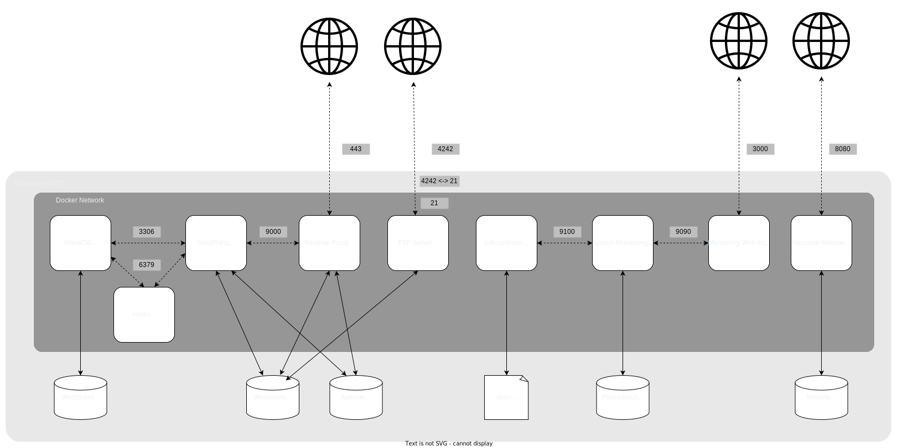

# 42-Inception

Infrastructure deployment with Docker

Final Grade : 

## Overview

The goal of this projet is to create an infrastructure of different services running in containers, inside a virtual machine. This infrasctrure allows to access a fully functionnal WordPress website using a regular browser

The following services will be running :

<ul>
  <li>NGINX with TLS</li>
  <li>WordPress + php-fpm</li>
  <li>MariaDB</li>
  <li>BONUS : Redis Cache</li>
  <li>BONUS : FTP Server</li>
  <li>BONUS : Personal Static WebSite</li>
  <li>BONUS : Adminer</li>
  <li>BONUS : Any service with usefull</li>
</ul>

## Constraints

<ul>
  <li>
    Each DockerFile has to be created from scratch : no using DockerFiles from dockerhub
  </li>
  <li>
    The whole project has to start using Make. This means the project structure must rely on :
    <ul>
      <li>A Makefile on top of...</li>
      <li>A docker-compose file using various...</li>
      <li>DockerFiles</li>
    </ul>
  </li>
  <li>
    Abiding by DockerFile best practices is mandatory : PID1, no sleep infinity in scripts, justify exposing ports...  
  </li>
</ul>

## Implemented Solution

The docker-compose file will start the following containers :

<ul>
  <li>
    NGINX : Main ingress point of the infrastructure. Listen https requests on port 443 and proxy passes them to the ad-hoc services. The main goal is to treat requests on .php files for the wordpress website, and send back php-fpm response to the client
  </li>
   <li>
    PHP-FPM : Processes .php files and send back the result. The main goal is to listen for GET/POST requests on the Wordpress .php files, process them and send the result back to NGINX. 
  </li>
     <li>
    MariaDB : Database server in charge of storing and retrieving data for the Website (users's posts, images...) 
  </li>
  <li>
    Redis Cache : Cache for requests on the website pages. Its role is to speed up the reponse time. Because DB queries and php rendering can be quite long, Redis will store in RAM (and optionnaly on disk) the results of the client requests. If 2 similar requests happen in a short time range, the first one will be treated normally (php + MariaDB), but the second one will be served by Redis, with a copy of the result of the first request.
  </li>
  <li>
    VSFTP : FTP server for updating the Worpress Website files. It provides a simple way (with a ftp client) to modify and update the website content without the need to have acces to the Virtual Machine filesystem.
  </li>
  <li>
    Monitoring system : Node_exporter / Prometheus / Grafana. It provides a monitoring interface with metrics (CPU usage, RAM usage, HDD access) of the Virtual Machine running the containers. It is built on top of 3 containers :
    <ul>
      <li>
        Node_exporter : Periodically collects info on ressources usage of the VM and sends them to Prometheus.
      </li>
      <li>
        Prometheus : Gathers info from node_exporter and stores them in a Database. Gives access to current VM info and history to clients, such as Grafana
      </li>
      <li>
        Grafana : Webinterface for reading the VM metrics. It is mainly a dashboard displaying the infos from Prometheus in a user friendly manner. It is accessible through port 3000
      </li>
    </ul>
  </li>
  <li>
    NodeJS : FTP server built with ExpressJS framework on the NodeJS environment. Serves the Personal Website files (completely different from the WordPress one)
  </li>
</ul>

### Schematics and Diagrams

  

## Usage

### Dependencies

### Install

## ROX (Return On Experience)

### Knowledge acquired during this project

### Challenges faced
